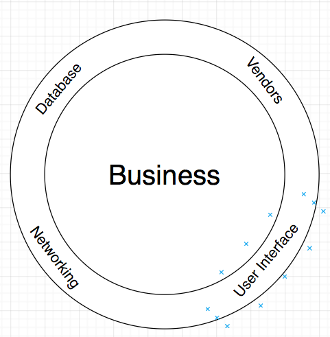

# WeatherAppWithCleanArchitecture
This project is a demonstration about how we apply Clean Architecture (https://8thlight.com/blog/uncle-bob/2012/08/13/the-clean-architecture.html) with RxSwift.

The main idea of Clean Architecture is to focus on protecting Business layer from Technology(Frameworks, Tools or Vendors) and User Interface. In the other words, changes from Technology or UI DO NOT impact to Business
# WeatherAppWithCleanArchitecture
This project is a demonstration about how we apply Clean Architecture (https://8thlight.com/blog/uncle-bob/2012/08/13/the-clean-architecture.html) with RxSwift.

The main idea of Clean Architecture is to focus on protecting Business layer from Technology(Frameworks, Tools or Vendors) and User Interface. In the other words, changes from Technology or UI DO NOT impact to Business



The projects include:
  + Domain and Platform frameworks present Business entities and Use cases
  + SearchCityRepository, AERISWeatherRepository, DarkSkyRepository are to query data from Vendors (https://www.aerisweather.com, http://forecast.io, Google Places) and convert/transform to Business Domain
  + WeatherUI implements application UI components
  + Beside that, There are unit tests
  
  Demo Gif:
  
  
  
## Requirements
* Xcode 9.0
* Swift 4.0
## Installation

### [CocoaPods](https://guides.cocoapods.org/using/using-cocoapods.html)

```bash
$ pod install
```

## References
* https://8thlight.com/blog/uncle-bob/2012/08/13/the-clean-architecture.html
* https://github.com/sergdort/CleanArchitectureRxSwift
* https://github.com/loopwxservices/WXKDarkSky

My email: poverty1990@gmail.com


The projects includes:
  + Domain and Platform frameworks present Business entities and Use cases
  + SearchCityRepository, AERISWeatherRepository, DarkSkyRepository are to query data from Vendors (https://www.aerisweather.com, http://forecast.io, Google Places) and convert/tranform to Business Domain
  + WeatherUI implements application UI components
  + Beside that, There are unit tests
  
  Demo Gif:
  
  
  
## Requirements
* Xcode 9.0
* Swift 4.0
## Installation

### [CocoaPods](https://guides.cocoapods.org/using/using-cocoapods.html)

```bash
$ pod install
```

## References
* https://8thlight.com/blog/uncle-bob/2012/08/13/the-clean-architecture.html
* https://github.com/sergdort/CleanArchitectureRxSwift
* https://github.com/loopwxservices/WXKDarkSky

My email: poverty1990@gmail.com
